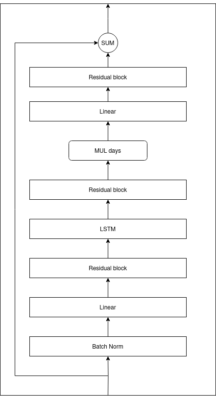

## Resumen rápido

Hemos usado un modelo del cuerpo 3D y una red neuronal para predecir cómo cambia
el cuerpo durante un régimen de pérdida de peso.

::: incremental

- Revisión de la literatura sobre modelar cuerpos humanos en 3D.

- Procesamiento y limpieza de los datos disponibles.

- Desarrollo e implementación de una red neuronal.

:::

# Representación del cuerpo en 3D

---

## Taxonomía de modelos

Basada en los tipos de entradas y salidas:

---

### Entrada

- 2D

- 3D

- Modelos paramétricos

-----

### Salida

- Espacio 2D 

- Mallas 3D

- Vóxels 3D

- _NeRF_

---

## Modelos paramétricos

Representar y generar modelos 3D basados en parámetros ajustables.

---

### Skinned Multi-Person Linear Model (SMPL)

Divide un cuerpo en:

- 10 parámetros de forma $\beta$
- 72 parámetros de pose $\theta$

# Análisis de datos y preprocesamiento

---

### Datos disponibles

- 80 pacientes
- 400 sesiones
- 200 escaneos 3D

---

+---------------------+----------------------------------------------------+--------------------------------------------+
| Tipo                | Fuente                                             | Medidas (unidad)                           |
+=====================+====================================================+============================================+
| Antropométrico      | Cinta métrica flexible                             | - Muñeca (cm)                              |
|                     |                                                    | - Cintura (cm)                             |
|                     |                                                    | - Cadera (cm)                              |
+---------------------+----------------------------------------------------+--------------------------------------------+
| Composición corporal| - Báscula Tanita MC 780-P MA                       | - Grasa por extremidad y tronco (%)        |
|                     | - Estadiómetro Seca 213                            | - Músculo por extremidad y tronco (%)      |
|                     |                                                    | - Grasa total y músculo (%)                |
|                     |                                                    | - Área de grasa visceral (cm²)             |
|                     |                                                    | - Peso (kg)                                |
|                     |                                                    | - Altura (m)                               |
+---------------------+----------------------------------------------------+--------------------------------------------+
| Otro, Estilo de vida| Entrevista                                         | - Actividad (puntuación)                   |
|                     |                                                    | - Género                                   |
|                     |                                                    | - Edad (años)                              |
+---------------------+----------------------------------------------------+--------------------------------------------+
| Sangre (capilar)    | Accutrend Plus                                     | - Glucosa (mg/dL)                          |
|                     |                                                    | - Colesterol (mg/dL)                       |
|                     |                                                    | - Triglicéridos (mg/dL)                    |
+---------------------+----------------------------------------------------+--------------------------------------------+
| Presión arterial    | Omron M3                                           | - Presión sistólica (mmHg)                 |
|                     |                                                    | - Presión diastólica (mmHg)                |
+---------------------+----------------------------------------------------+--------------------------------------------+

_Tech4Diet_

---

### Sistema escaneo 3D

{ width=50% }

13 cámaras _Intel Realsense RGB-D_.

---

### Extracción de parámetros SMPL

- Adquisición de modelos 3D.

- Estimación de plantilla intermedia BPS.

- Primera minimización.

- Segunda minimización.

Garcia-D'Urso et al. (2023). _Accurate estimation of parametric models of the human body from 3d point clouds_

# Redes neuronales

---

## Análisis de arquitecturas para sequencias

Tipos planteados:

- Recurrentes

    - RNN

    - LSTM

    - GRU

- Transformers

---

## Desarrollo de una red neuronal

PyTorch

Basada en LSTM

---

{width=40%}

# Resultados

