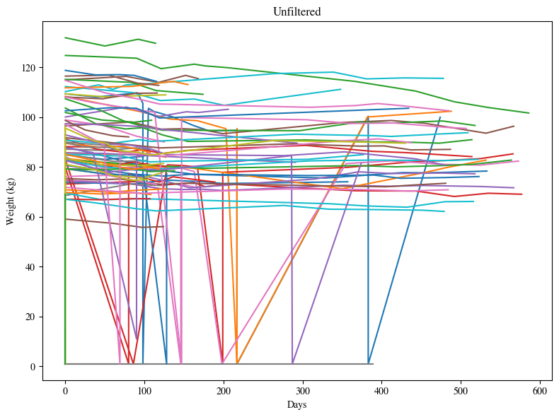
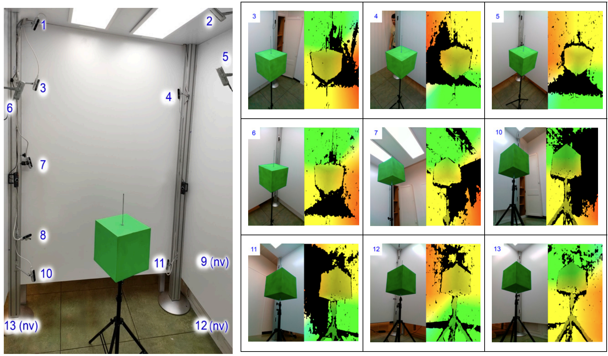
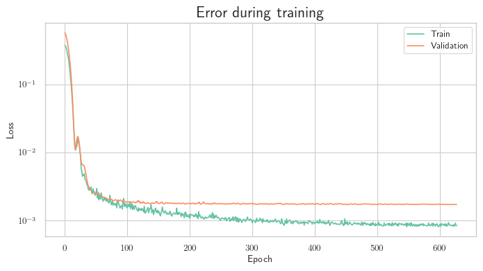
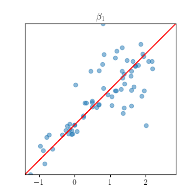
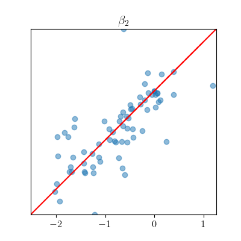
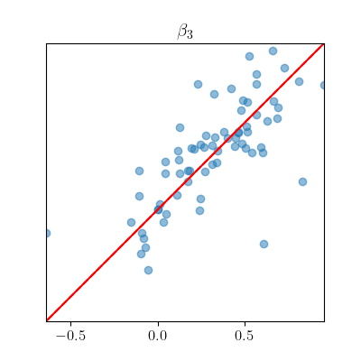
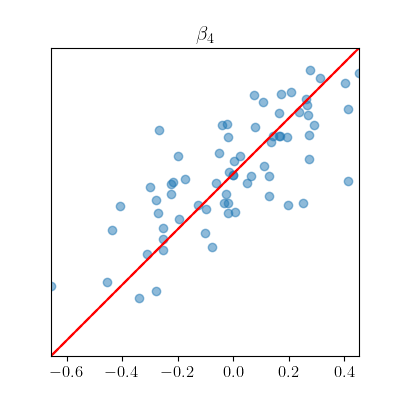
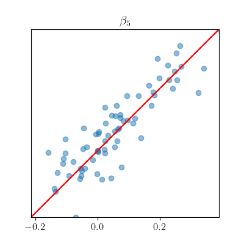
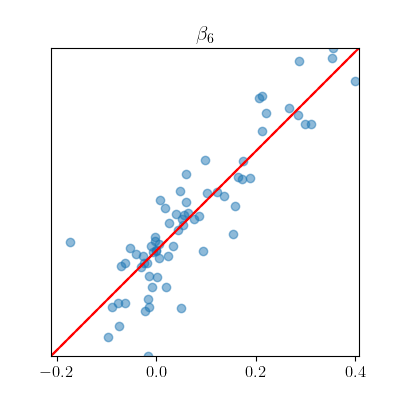
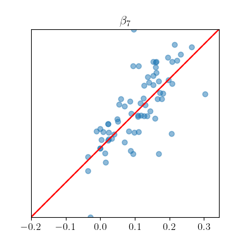

## {data-auto-animate=}

Hemos usado un modelo del cuerpo 3D y una red neuronal para predecir cómo cambia
el cuerpo durante un régimen de pérdida de peso.

## {data-auto-animate=}

Hemos usado un modelo del cuerpo 3D y una red neuronal para predecir cómo cambia
el cuerpo durante un régimen de pérdida de peso.

- Revisión de la literatura sobre modelar cuerpos humanos en 3D.

- Procesamiento y limpieza de los datos disponibles.

- Desarrollo e implementación de una red neuronal.

## Representación del cuerpo en 3D

---

## Revisión de la literatura

Presentada en la conferencia IWANN 2023.

---

## Taxonomía de modelos

Basada en los tipos de entradas y salidas:

:::::::::::::: columns
::: {.column width="50%"}

### Entradas

- 2D (imágenes, vídeos...)

- 3D

- Modelos paramétricos

:::
::: {.column width="50%"}

### Salidas

- Espacio 2D

- Mallas 3D

- Vóxels 3D

- _NeRF_

:::
::::::::::::::

---

## Modelos paramétricos

Representar y generar modelos 3D basados en parámetros ajustables.

---

## Skinned Multi-Person Linear Model (SMPL)

::: r-stretch

Permite descomponer un cuerpo en:

- Malla de topología estática $T$
- 10 parámetros de forma $\beta$
- 72 parámetros de pose $\theta$

:::

{height=200px}

---

## Análisis de datos y preprocesamiento

---

## Datos disponibles

::: {.fragment}

- 80 pacientes
- 400 sesiones
- 200 escaneos 3D

:::

---

::: {style="font-size: 16px"}

+---------------------+----------------------------------------------------+--------------------------------------------+
| Tipo                | Fuente                                             | Medidas (unidad)                           |
+=====================+====================================================+============================================+
| Antropométrico      | Cinta métrica flexible                             | - Muñeca (cm)                              |
|                     |                                                    | - Cintura (cm)                             |
|                     |                                                    | - Cadera (cm)                              |
+---------------------+----------------------------------------------------+--------------------------------------------+
| Composición corporal| - Báscula Tanita MC 780-P MA                       | - Grasa por extremidad y tronco (%)        |
|                     | - Estadiómetro Seca 213                            | - Músculo por extremidad y tronco (%)      |
|                     |                                                    | - Grasa total y músculo (%)                |
|                     |                                                    | - Área de grasa visceral (cm²)             |
|                     |                                                    | - Peso (kg)                                |
|                     |                                                    | - Altura (m)                               |
+---------------------+----------------------------------------------------+--------------------------------------------+
| Otro, Estilo de vida| Entrevista                                         | - Actividad (puntuación)                   |
|                     |                                                    | - Género                                   |
|                     |                                                    | - Edad (años)                              |
+---------------------+----------------------------------------------------+--------------------------------------------+
| Sangre (capilar)    | Accutrend Plus                                     | - Glucosa (mg/dL)                          |
|                     |                                                    | - Colesterol (mg/dL)                       |
|                     |                                                    | - Triglicéridos (mg/dL)                    |
+---------------------+----------------------------------------------------+--------------------------------------------+
| Presión arterial    | Omron M3                                           | - Presión sistólica (mmHg)                 |
|                     |                                                    | - Presión diastólica (mmHg)                |
+---------------------+----------------------------------------------------+--------------------------------------------+

:::

<small>

N. García-D’urso, P. Climent-Pérez, M. Sánchez-Sansegundo, A. Zaragoza-Martí, A. Fuster-Guilló and J. Azorín-López,

"[_A Non-Invasive Approach for Total Cholesterol Level Prediction Using Machine Learning_](https://doi.org/10.1109/ACCESS.2022.3178419),"

in _IEEE Access_, vol. 10, pp. 58566-58577, 2022, doi: [10.1109/ACCESS.2022.3178419](https://doi.org/10.1109/ACCESS.2022.3178419).

</small>

---

## Limpieza de datos

::::: r-fit-text

Creación de proceso de análisis y limpieza de datos usando
la biblioteca _pandas_.

::: fragment

- Detección de casos atípicos.
    
    - Suma de músculo y grasa > 100 %.

    - Diferencias grandes entre medidas de extremidades.

:::

::: fragment

- Errores decimales.
    
    - Omisión de separador decimal o unidades erróneas.

:::

:::::

--- 

## Filtrado de la variable "peso" {data-auto-animate=}

{.r-stretch}

---

## Filtrado de la variable "peso" {data-auto-animate=}

::::: columns

::: column

Sin filtrar

:::

::: column 

Filtrado

:::

:::::

---

## Sistema escaneo 3D

{ width=50% }

13 cámaras _Intel Realsense RGB-D_.

---

## Extracción de parámetros _SMPL_  {data-auto-animate=}

<small>
N. García-D'Urso et al., "Accurate estimation of parametric models of the human body from 3d point clouds"
</small>

---

## Extracción de parámetros _SMPL_  {data-auto-animate=}

---

::: {.r-fit-text}

1. Adquisición de modelos 3D.

    - Capturar una nube de puntos con las 13 cámaras RGB-D.

    - Reducir ruido y optimizar alineamiento

2. Estimación de plantilla intermedia con _BPS_.

    - Codificar la nube de puntos usando _Basis Point Set_.

    - Predecir posiciones de vértices con una _NN_.

3. Primera minimización.

    - Minimizar parámetros _SMPL_ para alinearlo con la plantilla creada con _BPS_.

4. Segunda minimización.

    - Alinear modelo _SMPL_ con el escaneo original.

:::

## Red neuronal

---

## Análisis de arquitecturas para sequencias

Tipos planteados:

- Recurrentes

    - RNN

    - LSTM

    - GRU

- Transformers

---

## Problemas {data-auto-animate=}

### Pacientes con distinto número de sesiones.

### Pacientes con sesiones espaciadas irregularmente o faltantes.

---

## Problemas {data-auto-animate=}

### Pacientes con distinto número de sesiones.

Las redes recurrentes son flexibles respecto a la longitud de secuencia.

### Pacientes con sesiones espaciadas irregularmente o faltantes.

---

## Problemas {data-auto-animate=}

### Pacientes con distinto número de sesiones.

Las redes recurrentes son flexibles respecto a la longitud de secuencia.

### Pacientes con sesiones espaciadas irregularmente o faltantes.

En vez de predecir la siguiente sesión, predecir el cambio diario.

---

::::: columns

::: column

{height=500px}

:::

::: column

### Detalles de la arquitectura

Añadimos una conexión residual para calcular la variación entre sesiones.

Calculamos los días entre sesiones y multiplicamos las predicciones
por ese valor.

:::

:::::

::: {.r-fit-text}
$X : ([B, [T_1, ..., T_{Nmax - 1}], [\beta, Height, Weight, Age, Sex]], Days)$
$Y : [B, [T_2, ..., T_{Nmax}], [\beta, Height, Weight, Age, Sex]]$
:::

---

Desarrollamos la red neuronal utilizando la biblioteca _PyTorch_ con aceleración
por _GPU_.

Implementamos una búsqueda de malla de hiperparámetros.

Entrenamos usando un _learning rate_ dinámico y el optimizador _AdamW_, con 
validación _5-fold_.

{.r-stretch}

---

| **Hiper-parámetro**                  | **Valor** |
|-------------------------------------|-----------|
| Tamaño del lote (_Batch size_)        | 32        |
| Número de capas en la entrada       | 4         |
| Número de capas en el LSTM          | 4         |
| Número de capas en la salida        | 4         |
| Tamaño oculto ($H$)                 | 32        |
| Decaimiento de peso (_Weight decay_)  | 0.001     |

## Resultados

---

Error medio por parámetro $\beta$.

---

{width="19%"}
{width="19%"}
{width="19%"}
{width="19%"}
{width="19%"}

{width="19%"}
{width="19%"}
{width="19%"}
{width="19%"}
{width="19%"}

Predicciones de parámetros $\beta$.

---

<video controls loop autoplay>
    <source src='2.mp4' type="video/mp4">
</video>

_Ground truth_ y predicciones de un paciente.

---

## Discusión

- Escala de tiempo pequeña para aprender dinámicas a largo plazo.
- Error alto en el _ground truth_.

---

## Posibles futuras líneas de trabajo 

::: r-fit-text

- **Recolección de Datos**: Los pacientes podrían enviar imágenes en lugar de escaneos 3D _in-situ_ para tener más datos.
- **Arquitectura de Red Neuronal**: Aunque elegimos la arquitectura _LSTM_, se podrían explorar otras, como Transformers, buscando mejoras en el rendimiento de predicción.
- **Modelos Paramétricos**: Considerar otros modelos como _STAR_ como alternativas o complementos al modelo _SMPL_ utilizado.
- **Renderizado de Salida**: Explorar _SMPLpix_ para renderizar en 2D. Usando el mismo modelo y parámetros predichos, podríamos generar imágenes realistas de los cuerpos en lugar de depender de modelos 3D.

:::

---

### Muchas gracias
